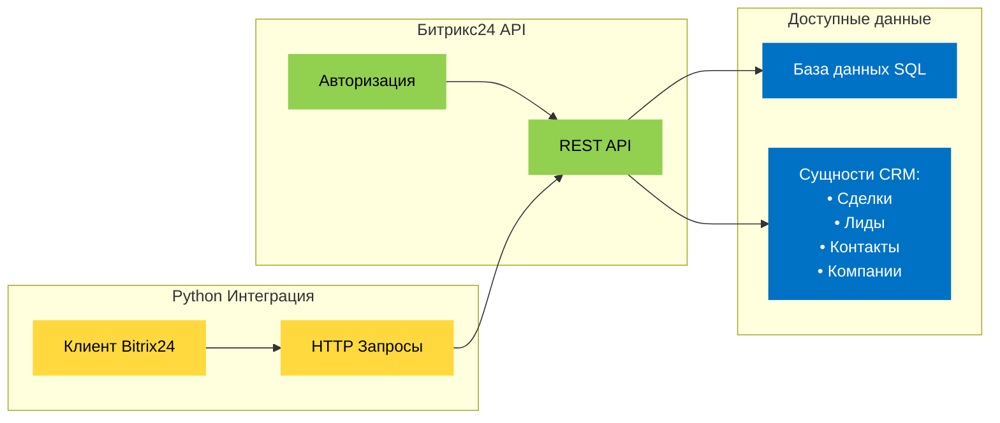

Я python разработчик и предо мной встала задача :

1. Разработка скриптов на Python для автоматизации процессов в Битрикс24.

2. Написание скриптов на Python для обработки данных из Битрикс24 и использования в других сервисах.

3. Создание сценариев на Python для сбора информации из разных источников и ее внесения в Битрикс24.

4. Интеграция ботов на Python в чаты Битрикс24 для быстрого доступа к информации и управления задачами.

5. Разработка модулей на Python для расширения функционала Битрикс24.

6. Обучение сотрудников работе с Python и Битрикс24, а также создание документации для пользователей.

7. Установка и настройка среды для разработки на Python и подключения к Битрикс24.

8. Интеграция python + telebot + Битрикс24


bitrix-python-integration/\
│ \
├── config &nbsp;&nbsp;&nbsp;&nbsp;&nbsp;&nbsp;&nbsp;&nbsp;&nbsp;&nbsp;&nbsp;&nbsp;&nbsp;&nbsp;&nbsp;&nbsp;&nbsp;&nbsp;&nbsp;&nbsp;&nbsp;&nbsp;&nbsp;&nbsp;&nbsp;&nbsp;&nbsp; # Конфигурация\
├── bitrix_client.py   &nbsp;&nbsp;&nbsp;&nbsp;&nbsp;&nbsp;&nbsp;&nbsp; &nbsp;&nbsp;&nbsp;&nbsp;&nbsp;&nbsp;   # Базовый клиент\
├── data_processor.py   &nbsp;&nbsp;&nbsp;&nbsp;&nbsp;&nbsp;&nbsp;&nbsp;   # Обработка данных\
├── telegram_bot.py    &nbsp;&nbsp;&nbsp;&nbsp;&nbsp;&nbsp;&nbsp;&nbsp;&nbsp;&nbsp;&nbsp;&nbsp;    # Telegram бот\
├── automation/        &nbsp;&nbsp;&nbsp;&nbsp;&nbsp;&nbsp;&nbsp;&nbsp;&nbsp;&nbsp;&nbsp;&nbsp;&nbsp;&nbsp;&nbsp;&nbsp;&nbsp;&nbsp;&nbsp;&nbsp;    # Автоматизация\
│   ├── deal_creator.py\
│   └── contact_sync.py\
├── modules/              &nbsp;&nbsp;&nbsp;&nbsp;&nbsp;&nbsp;&nbsp;&nbsp;&nbsp;&nbsp;&nbsp;&nbsp;&nbsp;&nbsp;&nbsp;&nbsp;&nbsp;&nbsp;&nbsp;&nbsp;&nbsp;&nbsp;&nbsp;&nbsp;&nbsp;&nbsp; # Кастомные модули\
│   ├── custom_module.py\
│   └── notification_system.py\
├── pyproject.toml      &nbsp;&nbsp;&nbsp;&nbsp;&nbsp;&nbsp;&nbsp;&nbsp;&nbsp;&nbsp;&nbsp;&nbsp;&nbsp;&nbsp; # Зависимости\
└── README.md             &nbsp;&nbsp;&nbsp;&nbsp;&nbsp;&nbsp;&nbsp;&nbsp;&nbsp;&nbsp;&nbsp;&nbsp;&nbsp;&nbsp;&nbsp;&nbsp;&nbsp;&nbsp;&nbsp;&nbsp;# Документация


🚀 `Python`-разработчики, давайте разберемся с этой "страшной" интеграцией с Битрикс24! 🐍

###  Что такое Битрикс24?

- CRM-система с открытым API
- Работает через REST-запросы (ваш любимый HTTP!)
- База данных доступна через стандартные SQL-запросы



###  Как это работает на практике?

Вот простой пример работы с Битрикс24 через Python:

```python
import requests

# Авторизация и получение токена
auth_url = f"https://{domain}.bitrix24.com/rest/crm.deal.list"
response = requests.get(auth_url, params={
    'auth': 'your_token'
})

# Работа с данными
deals = response.json()['result']
```

###  Что можно делать?

- Чтение данных из CRM (сделки, лиды, контакты)
- Создание новых записей
- Обновление существующих данных
- Удаление записей
- Работа с пользовательскими полями

###  О безопасности

- Все запросы идут по HTTPS
- Используется система токенов доступа
- Есть ограничения на количество запросов в минуту
- Доступ к данным контролируется через права пользователей

###  О "страшном PHP" 😄

- Вы работаете только с REST API
- Никакого PHP не требуется
- Все запросы стандартные HTTP
- Ответы приходят в JSON

###  О базе данных

- Доступна через стандартный SQL
- Структура документирована
- Можно делать SELECT, INSERT, UPDATE, DELETE
- Поддерживает все современные СУБД

###  Важные замечания

- Нужен доступ к API от администратора
- Требуется настройка прав доступа
- Рекомендуется использовать официальную библиотеку
- Обязательно читайте документацию по лимитам API

Итог: никакой "доисторический PHP" нам не нужен! 🙅‍♂️ Работаем чистым Python'ом с REST API и получаем доступ ко всем данным Битрикс24. Кто сказал, что это сложно? 😎
